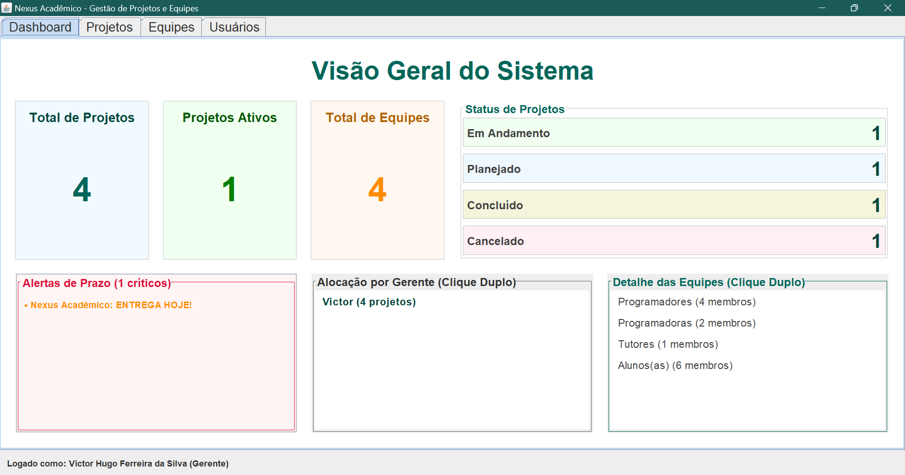
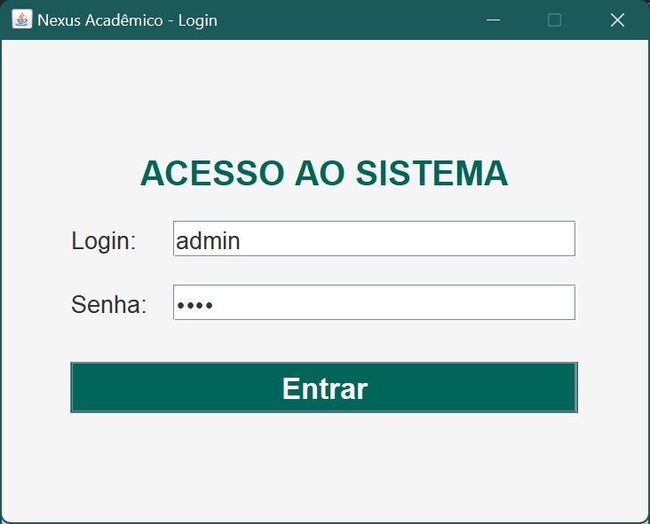
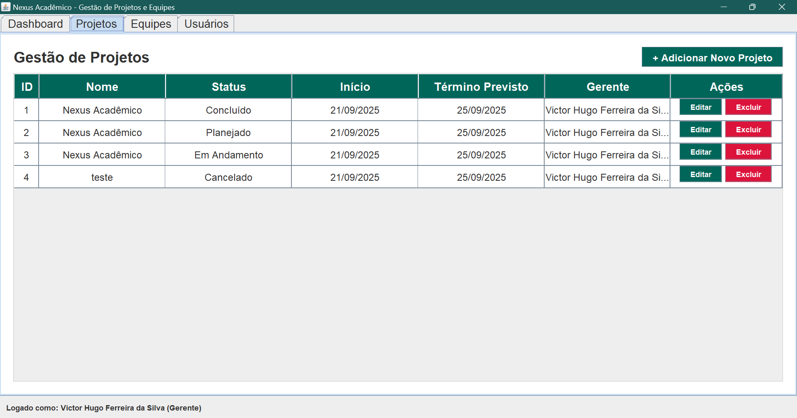
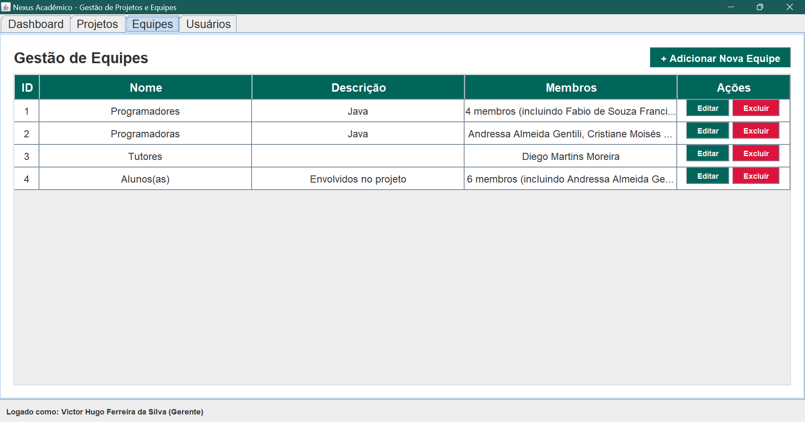
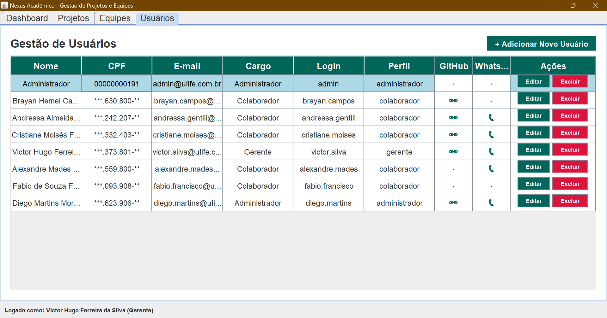
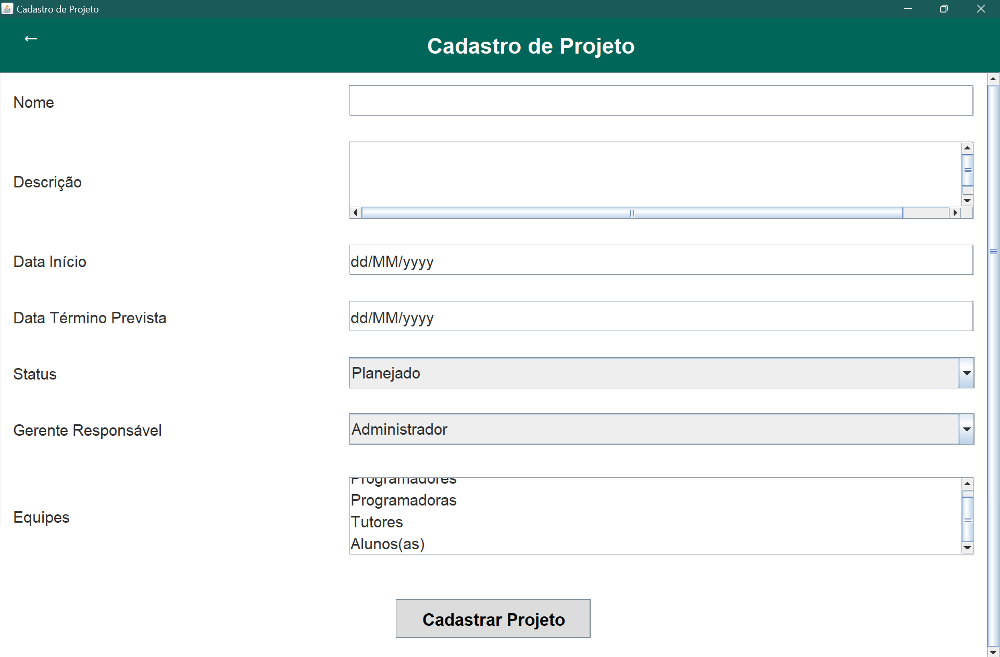
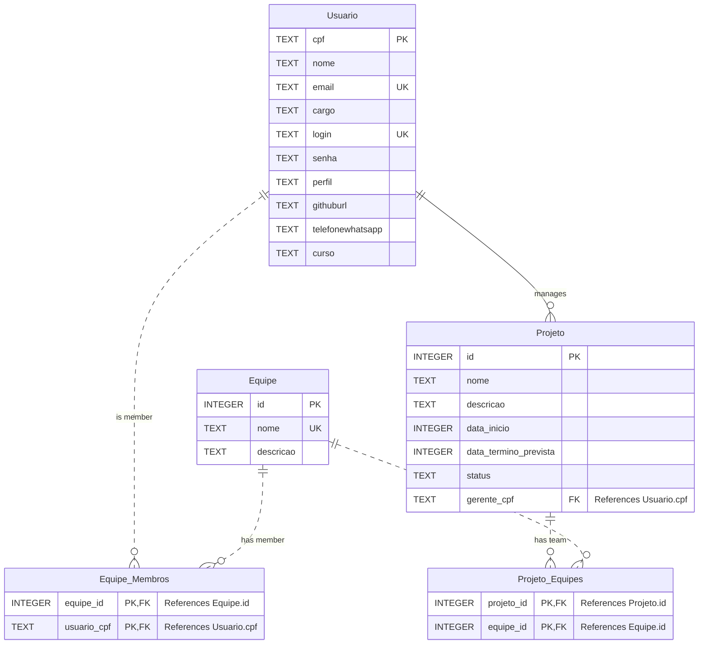

# :checkered_flag: Nexus Acadêmico

[]()
[-orange)](https://www.java.com)
[](./docs/padroes.md)
[-red)](https://docs.oracle.com/javase/8/docs/technotes/guides/swing/)
[-darkgreen)](https://www.sqlite.org/index.html)

## :mag_right: Visão geral

O Nexus Acadêmico é um Sistema Desktop de gestão de projetos de pequeno porte, especificamente desenhado para universidades, laboratórios de pesquisa e grupos de estudo. Ele oferece um controle centralizado de recursos sem a complexidade ou custo de plataformas SaaS.

É a solução ideal para gerenciar o progresso de Trabalhos de Conclusão de Curso (TCCs), projetos de extensão e grupos de pesquisa, controlando de perto a participação, a carga de trabalho e o ciclo de vida dos projetos desenvolvidos por alunos e colaboradores.

### Desafios

Este software foi construído para eliminar as principais dores de cabeça na gestão diária, garantindo organização, transparência e responsabilidade:

1. Status e prazos claros: Elimina a confusão sobre o status e a data de entrega dos projetos através de um Painel Dashboard intuitivo.
2. Alocação definida: Resolve a alocação indefinida, garantindo que cada projeto tenha um único gerente responsável e que as equipes tenham seus membros explicitamente listados.
3. Segurança e controle: Implementa a segurança básica com perfis de acesso distintos (Administrador, Gerente, Colaborador) e centraliza o cadastro de colaboradores, facilitando o acesso rápido a dados de contato.

### Ponto focal

- Custo zero e adaptabilidade: Código Open Source sob a Licença MIT, o que garante custo zero de aquisição e total adaptabilidade para customizações futuras.
- Ficha técnica: Desenvolvido em Java/Swing com persistência SQLite em documentação amigável para fácil implantação, sustentação e inovação.

### Arquitetura e qualidade de código

A qualidade é o pilar do software, desenvolvido com foco na aplicação conceitual dos princípios de Orientação a Objetos (POO) e Padrões de Projeto (Design Patterns).

A arquitetura é limpa, baseada nos padrões MVC, DAO, Repository e Factory, assegurando o isolamento de camadas e a Separação de Responsabilidades (SRP). Isso torna a manutenção e a adição de novas funcionalidades mais rápidas e com um risco mínimo de introduzir erros.

Todo o código-fonte está integralmente redigido em Português do Brasil. Essa padronização linguística não só adere ao Clean Code, mas também garante que classes, métodos e variáveis sejam logicamente intuitivos. O resultado é uma redução drástica na curva de aprendizado e no tempo de onboarding para novos desenvolvedores e entusiastas, levando excelência em manutenibilidade.

| Conceito | Metodologia aplicada |
| :--- | :--- |
| **POO** | **Encapsulamento** (dados privados das classes, acesso via Getters/Setters públicos), **Abstração** com classes de modelos Usuario, Equipe e Projeto representando objetos do mundo real, tendo CPF com validação de dígitos reais e sendo utilizados como identificador único, **Herança** e **Polimorfismo** (nas interfaces genéricas DAO<T>) definindo o contrato de persistência (CRUD), promovendo a reutilização e a segurança dos dados. |
| **Padrão MVC** | Separação estrita de responsabilidades: **Model** (dados), **View** (Swing UI), e **Controller** (lógica de negócio). |
| **Padrão DAO** | **Data Access Object**. Isola completamente a camada de persistência (SQL/JDBC) do restante da aplicação, facilitando futuras migrações de banco de dados. |
| **Padrão Factory** | A classe `Conexao` é uma **Connection Factory** segura, centralizando a criação e configuração de recursos complexos do JDBC. |
| **Design UI** | Interface nativa desenvolvida com **Java Swing** que oferece uma experiência de usuário direta, intuitiva e funcional. | 
| **Clean Code** | Tratamento de exceções de alta qualidade com uso de blocos `try-catch`com mensagens amigáveis para o usuário, gerenciamento de recursos com `try-with-resources`previnindo vazamentos de memória (memory leaks) e falhas ao fechar automaticamente conexões JDBC e validação de negócio na camada Controller antes de persistir os dados no DAO (como CPF e e-mail), além de código de acordo com as regras de negócio para facilidade de manutenção, documentação técnica com Javadocs e estratégica com github. |

## :eyes: Front-end (Screenshots)

<p align="center">
    
</p>
<p align="center">
    <a href="./img/TelaLogin.png" target="_blank">
        
    </a>
    <a href="./img/PainelProjetos.png" target="_blank">
        
    </a>
    <a href="./img/PainelEquipes.png" target="_blank">
        
    </a>
    <a href="./img/PainelUsuarios.png" target="_blank">
        
    </a>
    <a href="./img/PainelProjetos_CadastrarProjeto.png" target="_blank">
        
    </a>
</p>

## :gem: Funcionalidades

| Módulos (CRUD) | Finalidade |
| :--- | :--- |
| **Gestão de Usuários** | Cadastro com perfis de acesso (`administrador`, `gerente`, `colaborador`).
| **Gestão de Projetos** | Controle de status, datas de início/fim e gerente responsável.
| **Gestão de Equipes** | Definição de membros (usuários) e associação a múltiplos projetos.
| **Dashboard** | Visualização estratégica de métricas de projetos e equipes.

## :rocket: Tecnologias

| Componente | Tecnologia | Propósito |
| :--- | :--- | :--- |
| **Linguagem** | [**Java 25 (JDK)**](https://www.oracle.com/java/technologies/downloads/#java25) | Core da aplicação. |
| **Interface Gráfica (View)** | **Swing** | Experiência nativa de aplicação Desktop. |
| **Gerenciamento de dependências** | **Apache Maven** | Automação de builds, bibliotecas (sqlite-jdbc) e ciclo de vida do projeto. |
| **Banco de dados** | **SQLite (JDBC)** | Persistência de dados leve e local através do JDBC. |
| **Versionamento** | **Git/GitHub** | Controle de versão e colaboração em equipe. |

---

## :beginner: Como começar
Siga os passos abaixo para baixar, configurar e executar o **Nexus Acadêmico** em sua máquina.

### :information_source: Pré-requisitos

- **Java (JDK) 25:** A versão da linguagem utilizada.
- **Git:** Ferramenta para baixar (clonar) o código do GitHub.
- **Maven:** (Opcional, mas recomendado) Vem com a maioria dos IDEs modernos (Eclipse, IntelliJ) e é usado para gerenciar as dependências.

### :one: Clonar o repositório
> [!TIP]
> Este passo baixa todos os arquivos do projeto para o seu computador.

```bash
git clone [https://github.com/seu-usuario/nexus-academico.git](https://github.com/seu-usuario/nexus-academico.git)
```

### :two: Configurar e compilar (Maven)
> [!TIP]
> O Maven irá automaticamente baixar o driver SQLite JDBC necessário para o banco de dados.
O comando abaixo baixa dependências (libraries) e compila o código-fonte (.java em .class).

```bash
mvn clean install
```

### :three: Executar a aplicação (mvn exec:java)
> [!TIP]
> O Main.java executa a classe principal do projeto (br.estudantesuam.ead.nexusacademico.Main).

> [!IMPORTANT]
> O Main se encarrega de tudo! Ele cria o arquivo nexus.db (o banco de dados local) e aplica o esquema SQL (tabelas e o usuário administrador padrão) automaticamente, abrindo em seguida a Tela de Login.

Ele é o responsável por:
- Verificar se o arquivo de banco de dados (nexus.db) existe.
- Se não existir, ele cria e popula o esquema SQL (tabelas e o usuário admin).
- Abre a Tela de Login (Swing UI).

```bash
mvn exec:java
```

### :four: Acesso ao Sistema (Login)

> [!CAUTION]
> A senha com hardcode sem encriptação é utilizada apenas para fins de desenvolvimento.

Na tela que se abrir, utilize as credenciais padrão de Administrador:
| Campo	| Valor |
| :---: | :---: |
| Login	| admin |
| Senha | 1234 |

## :lady_beetle: Diagrama Entidade-Relacionamento (ER)

> [!TIP]
> Este diagrama representa as relações centrais entre as suas tabelas, enfatizando as entidades associativas que tratam as relações de muitos para muitos (N:M):

- Entidades Principais: Usuario, Equipe, Projeto.
- Entidades Associativas (N:M): Equipe_Membros, Projeto_Equipes.
- Relacionamentos Chave:
  - Usuário gerencia Projeto (1:N): Um Usuario (Gerente) é responsável por zero ou muitos Projetos.
  - Usuário pertence a Equipe (N:M): Resolvido pela tabela Equipe_Membros.
  - Projeto utiliza Equipe (N:M): Resolvido pela tabela Projeto_Equipes.
- Atributos Chave: As Chaves Primárias (PK), Chaves Estrangeiras (FK) e restrições de Unicidade (UK) estão devidamente anotadas.



## :sparkling_heart: Contribuições
Este projeto é um esforço colaborativo de uma equipe de desenvolvimento, focado em aplicar metodologias ágeis e padrões de código limpo.
Agradecemos a dedicação de todos os desenvolvedores(as):

<p>
  <a href="https://github.com/hemelbrayan"></a>
  <a href="https://github.com/andressagentile94-oss"></a>
  <a href="https://github.com/euvictorhfs"></a>
  <a href="http://github.com/cristianemoises2026-spec"></a>
  <a href="https://github.com/alexandremades09-bit"></a>
  <a href="http://github.com/fabioszf"></a>
</p>

## :bookmark_tabs: Licença

Este projeto de laboratório acadêmico é distribuído sob a permissiva **Licença MIT**.

> [!NOTE]

> **Para detalhes completos sobre seus direitos e permissões, consulte o arquivo [LICENSE](LICENSE) na raiz deste repositório.**